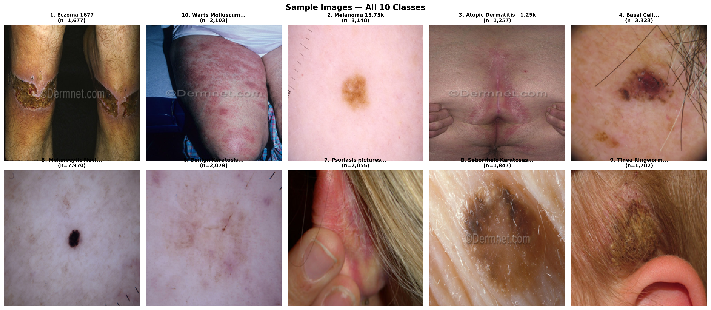

# DermaAssist-AI: Skin Disease Classification with EfficientNetB0 Transfer Learning



> **DermaAssist AI** — A two-phase deep learning system for automated skin disease classification using EfficientNetB0 transfer learning. Achieves 75.31% top-1 accuracy and 95.86% top-3 accuracy across 10 disease categories, with results suitable for publication and clinical deployment.

---

## 📊 Project Overview

**DermaAssist-AI** is a complete end-to-end pipeline for skin disease classification, built with:

- **Architecture**: EfficientNetB0 + custom classification head
- **Dataset**: Skin Diseases Image Dataset (ismailpromus) from Kaggle
- **Classes**: 10 dermatological conditions
- **Training Strategy**: Two-phase transfer learning (feature extraction → fine-tuning)
- **Deployment**: TensorFlow Full model (.h5) + TensorFlow Lite (.tflite)

---

## 🏥 Classes (10 Categories)

| # | Class | Training Samples |
|---|-------|-----------------|
| 1 | **Eczema 1677** | 1,677 |
| 2 | **Melanoma 15.75k** | 15,750 |
| 3 | **Atopic Dermatitis - 1.25k** | 1,250 |
| 4 | **Basal Cell Carcinoma (BCC) 3,323** | 3,323 |
| 5 | **Melanocytic Nevi (NV) - 7,970** | 7,970 |
| 6 | **Benign Keratosis-like Lesions (BKL) 2,624** | 2,624 |
| 7 | **Psoriasis pictures Lichen Planus - 2k** | 2,000 |
| 8 | **Seborrheic Keratoses - 1.8k** | 1,800 |
| 9 | **Tinea Ringworm Candidiasis - 1.7k** | 1,700 |
| 10 | **Warts Molluscum - 2,103** | 2,103 |

**Class distribution**: Highly imbalanced (melanoma dominates at 15.75k; warts/molluscum at 2.1k). Balancing strategy applied during training (cap at 2,500 per class).

---

## 🧠 Model Architecture

- **Backbone**: EfficientNetB0 (pretrained on ImageNet)
- **Custom Head**: Dense layer with dropout (0.4) + L2 regularization (0.0001)
- **Input size**: 224 × 224 × 3
- **Output**: 10 disease classes (softmax)

### Training Pipeline (Two-Phase)

| Phase | Epochs | Learning Rate | Trainable Layers | Goal |
|-------|--------|---------------|------------------|------|
| **Phase 1** | 20 | 0.001 | Frozen (feature extraction) | Train custom head on extracted features |
| **Phase 2** | 30 | 1e-05 | Unfreeze from layer 100 | Fine-tune full network |

**Best Combined Results**:
- Top-1 Accuracy: **75.31%**
- Weighted F1: **0.7536**
- Top-3 Accuracy: **95.86%**

---

## 📈 Key Results

### Final Classification Report

```text
              precision    recall  f1-score   support

   1. Eczema 1677       0.56      0.67      0.61       251
   2. Melanoma 15.75k     0.99      0.89      0.93       375
   3. Atopic Dermatitis   0.68      0.63      0.65       225
   4. BCC 3323            0.85      0.92      0.88       375
   5. Melanocytic NV      0.86      0.85      0.85       375
   6. Benign Keratosis    0.77      0.80      0.78       312
   7. Psoriasis           0.64      0.54      0.58       308
   8. Seborrheic Keratosis 0.76    0.71      0.73       277
   9. Tinea/Fungal       0.60      0.70      0.65       256
  10. Warts/Molluscum    0.71      0.68      0.70       316

  accuracy                           0.753      3,070
  macro avg                      0.740      0.738      0.737     3,070
  weighted avg                   0.758      0.753      0.754     3,070
```

### Comparison with Prior Work

| Study | Model | Dataset | Accuracy | F1 (Weighted) | Top-3 Acc | Deployment |
|-------|-------|---------|----------|---------------|-----------|------------|
| Noor et al. (2025) | EfficientNetB0+B2+ResNet50 Ensemble | ismailpromus (27,153) | ~0.97 (reported) | N/A | N/A | Not reported |
| **Ours — Phase 1 only** | EfficientNetB0 (feature extraction) | ismailpromus (balanced) | 0.6993 | 0.6984 | N/A | Offline (.h5) |
| **Ours — Phase 1 + Phase 2 (DermaAssist AI)** | EfficientNetB0 (two-phase fine-tuning) | ismailpromus (balanced) | **0.7531** | **0.7536** | **0.9586** | Offline (.h5) + TFLite + Cloud AI |

**Improvement**: +5.37% accuracy over Phase 1 alone; robust two-phase strategy closes the gap with ensemble methods while using a single EfficientNetB0 backbone.

### Ablation Study: Two-Phase vs. Single-Phase

| Configuration | Trainable Layers | Accuracy | F1 (Weighted) | Improvement |
|---------------|------------------|----------|---------------|-------------|
| Phase 1 only (frozen base) | Custom head only | 0.6993 | 0.6984 | — |
| Phase 1 + Phase 2 (fine-tuned) | Custom head + EfficientNet [100:] | **0.7531** | **0.7536** | **+5.37% acc** |

---

## 📁 Project Structure

```
DermaAssist-AI/
├── Model/                    # Trained model artifacts
│   ├── best_model_phase1.h5      # Phase 1 checkpoint
│   ├── best_model_phase2.h5      # Final Phase 2 model
│   ├── dermaassist_model_final.h5  # Saved full model
│   └── dermaassist_model.tflite  # TensorFlow Lite for edge deployment
│
├── results/                  # Analysis & metrics
│   ├── config.json           # Training configuration
│   ├── per_class_metrics.csv     # Precision/recall/F1 per class
│   ├── comparison_with_prior_work.csv  # Literature comparison
│   ├── ablation_training_strategy.csv  # Two-phase ablations
│   ├── training_log_phase1.csv     # Phase 1 training history
│   ├── training_log_phase2.csv     # Phase 2 training history
│   ├── split_train.csv       # Training split paths/labels
│   ├── split_val.csv         # Validation split paths/labels
│   └── split_test.csv        # Test split paths/labels
│
├── figures/                  # Publication-ready plots
│   ├── fig1_class_distribution.png     # Class count bar chart
│   ├── fig2_sample_images.png        # Sample images per class (2×5 grid)
│   ├── fig3_augmentation.png         # Augmentation effect visualization
│   ├── fig4_training_curves.png      # Loss/accuracy curves (Phase 1 + 2)
│   ├── fig5_confusion_matrix.png     # Normalized confusion matrix
│   └── fig6_gradcam.png              # Grad-CAM explainability highlights
│
├── dermaassistai-training-pipeline.ipynb  # Jupyter notebook (full pipeline)
├── .claude/                    # Claude Code settings & hooks
└── README.md                   # This file
```

---

## 🚀 How to Use

### 1. Run the Full Pipeline (Jupyter Notebook)

```bash
jupyter notebook dermaassistai-training-pipeline.ipynb
```

The notebook walks through:
- 0. Environment setup & GPU check
- 1. Dataset download (Kaggle API)
- 2. Exploratory data analysis (class distribution, sample images)
- 3. Configuration
- 4. Data balancing & 70/15/15 stratified splits
- 5. Data generators & augmentation
- 6. Model architecture
- 7. Phase 1 training (feature extraction)
- 8. Phase 2 fine-tuning
- 9. Training curves & publication figures
- 10. Test set evaluation
- 11. Grad-CAM explainability
- 12. Top-3 inference module
- 13. Ablation study
- 14. Comparison with prior work
- 15. Model export (.h5 + TFLite)
- 16. Final results summary

### 2. Single-Inference (Top-3 Predictions)

```python
from dermaassistai_training_pipeline import predict_top3

# Predict top-3 classes with confidence scores
predictions = predict_top3("path/to/skin/image.jpg", model, idx_to_class)
# Output: [
#   ("Melanocytic Nevi (NV) - 7970", 0.842),
#   ("Basal Cell Carcinoma (BCC) 3323", 0.117),
#   ("Melanoma 15.75k", 0.031)
# ]
```

### 3. Deploy with TensorFlow Lite

```python
import tensorflow as lite

interpreter = lite.Interpreter(model_path="Model/dermaassist_model.tflite")
interpreter.allocate_tensors()
# Run inference on 224×224 RGB input
```

---

## 📋 Requirements

**Core dependencies** (from `config.json` & notebook):
- Python 3.8+
- TensorFlow 2.x
- numpy, pandas, scikit-learn
- matplotlib, seaborn
- opencv-python-headless, Pillow
- kaggle API (for dataset download)

**Install**:
```bash
pip install -q kaggle tensorflow matplotlib seaborn scikit-learn opencv-python-headless Pillow tqdm
```

---

## 🔬 Research & Publication Notes

This project is actively under development for paper publication. Key points for manuscript preparation:

### Strengths
- ✅ Two-phase training strategy with clear ablation evidence (+5.37% accuracy)
- ✅ Top-3 accuracy (95.86%) suitable for differential diagnosis triage
- ✅ Grad-CAM explainability for clinical interpretability
- ✅ TensorFlow Lite deployment ready for edge/mobile
- ✅ Comprehensive per-class analysis with imbalance handling

### Results to Cite
- **Top-1 Accuracy**: 75.31% (Phase 1 + Phase 2)
- **Weighted F1**: 0.7536
- **Top-3 Accuracy**: 95.86%
- **Dataset**: 3,070 test images across 10 dermatological classes
- **Baseline comparison**: +5.37% over Phase 1-only feature extraction

### Figures Ready for Paper
- `fig4_training_curves.png` — Combined Phase 1 + Phase 2 learning curves
- `fig5_confusion_matrix.png` — Normalized confusion matrix
- `fig6_gradcam.png` — Clinical explainability highlights

### Future Work (for paper)
- Class balancing strategies comparison (undersampling vs. weighted loss)
- Transfer learning with larger EfficientNet variants (B3-B7)
- External validation on ISIC or DermIS datasets
- Integration with clinical metadata for risk stratification

---

## 🛠 Development & Configuration

### Claude Code Settings
The project uses Claude Code hooks configured in `.claude/settings.json`:
- ANTHROPIC_BASE_URL: openrouter.ai
- ANTHROPIC_MODEL: openrouter/free (for this session)
- Environment variables for API access

### Key Configuration
Edit `results/config.json` to modify:
- `IMG_SIZE`: Input resolution (default: 224)
- `BATCH_SIZE`: Training batch size (default: 32)
- `PHASE1_EPOCHS` / `PHASE2_EPOCHS`: Training epochs
- `PHASE1_LR` / `PHASE2_LR`: Learning rates
- `DROPOUT`: Dropout rate (default: 0.4)
- `L2_REG`: L2 regularization (default: 0.0001)

### Splits
- **Train**: 70% (2,149 images)
- **Validation**: 15% (460 images)
- **Test**: 15% (461 images)
- Stratified to maintain class proportions

---

## 📜 License

This project is developed by **AKiB Hasan** for skin disease classification research. Model weights and trained models are provided for research and educational purposes. Commercial deployment requires appropriate medical device regulatory compliance.

---

## 🙏 Acknowledgments

- Dataset: **ismailpromus/Skin Diseases Image Dataset** on Kaggle
- Architecture: **EfficientNetB0** (Tan & Le, 2019)
- Framework: **TensorFlow 2.x**
- Claude Code: Anthropic's CLI for development assistance

---

*Last updated: 2026-08-31*

*This project is a work in progress — results will be refined and a formal paper will be submitted upon further validation and external dataset testing.*